# Modelado del Sistema Elyra

> **Sistema de Gestión Hospitalaria — Hospital de Clínicas**
> **Metodología:** Modelo Esencial, Ambiental y de Comportamiento + UML
> **Versión:** 1.0 — Julio 2026

---

## Índice

1. [Modelo Esencial](#1-modelo-esencial)
2. [Modelo Ambiental](#2-modelo-ambiental)
3. [Modelo de Comportamiento](#3-modelo-de-comportamiento)
4. [Listas de Acontecimientos](#4-listas-de-acontecimientos)
5. [Diagramas UML](#5-diagramas-uml)

---

# 1. Modelo Esencial

> *¿Qué es el sistema? ¿Qué entidades existen? ¿Qué reglas de negocio rigen?*

## 1.1 Descripción Esencial del Sistema

**Elyra** es un sistema de gestión hospitalaria que administra:

- **Traslados de pacientes** entre hospitales con tracking GPS en tiempo real
- **Documentos médicos** con generación automática de códigos QR
- **Encuestas de satisfacción** para pacientes
- **Directorio de funcionarios** y conductores de ambulancias
- **Noticias internas** del hospital

**Frontera del sistema:** Elyra NO gestiona historial clínico, recetas médicas, facturación ni turnos. Se limita a trazabilidad documental, traslados y encuestas.

## 1.2 Modelo de Dominio (Entidades)

### Diagrama de Clases Simplificado

```
                        ┌──────────────┐
                        │   Usuario    │
                        │──────────────│
                        │ id: int      │
                        │ tipo: enum   │
                        │ nombre: str  │
                        │ apellido: str│
                        │ email: Email │
                        │ documento: str│
                        │ foto: blob   │
                        │ createdAt    │
                        └──────┬───────┘
                               │
                  ┌────────────┴────────────┐
                  │                         │
           ┌──────▼───────┐         ┌───────▼──────┐
           │ Funcionario  │         │   Paciente   │
           │──────────────│         │──────────────│
           │ username     │         │ tokenAcceso  │
           │ passwordHash │         │ username     │
           │ rol: Rol     │         │ passwordHash │
           │ licencia     │         │ telefono     │
           │ licConducir  │         │ activo       │
           │ telefono     │         └──────────────┘
           │ activo       │
           │ resetToken   │
           └──────────────┘
```

### Entidades del Dominio

| Entidad | Atributos Clave | Reglas de Negocio |
|---------|----------------|-------------------|
| **Usuario** | id, tipo, nombre, apellido, email, documentoIdentidad, foto | Base de herencia (STI). Email único. CI única. |
| **Funcionario** | username, passwordHash, rol, licencia, licenciaConducir, activo | Extiende Usuario. Rol controla permisos. bcrypt cost 12. Baja lógica (activo=false). |
| **Paciente** | tokenAcceso, username, passwordHash, telefono, activo | Extiende Usuario. Token UUID v4 para acceso público QR. |
| **Traslado** | codigo, conductorId, copilotoId, vehiculoId, rutaId, origen, destino, coordenadas, estado, horas | Máquina de estados estricta. Código único (TR-XXX). Origen ≠ destino. |
| **ElementoTraslado** | trasladoId, tipo, pacienteId, descripcion, cantidad | Un traslado tiene 1 elemento. Tipo: paciente/organo/equipamiento/insumo. |
| **HistorialEstado** | trasladoId, estadoAnterior, estadoNuevo, observacion, actualizadoPor | Inmutable. Se preserva al borrar traslado (SET NULL). |
| **Documento** | titulo, archivoPath, archivoNombre, categoriaId, pacienteId, subidoPor, codigoQrId | Solo PDF. Máx 10MB. QR generado automáticamente. |
| **Categoria** | nombre, tipo | Tipo: especialidad o tipo_documento. Nombre único. |
| **Encuesta** | titulo, descripcion, activa, creadaPor | Solo admin crea. Pacientes responden. |
| **Pregunta** | encuestaId, tipo, texto, opciones, requerida, orden | Tipo: multiple_choice/escala/texto_libre. Opciones en JSON. |
| **Respuesta** | sesionToken, encuestaId, preguntaId, tokenPaciente | Unique por (sesion_token, pregunta_id). Anónima si es público. |
| **Ruta** | nombre, origen, destino, distancia_km | Origen y destino son strings (direcciones). Distancia en km. |
| **Vehiculo** | patente, modelo, anio | Patente única. |
| **UbicacionConductor** | conductorId, trasladoId, latitud, longitud, heading, velocidad | Un upsert por conductor (una fila). |
| **HistorialUbicacion** | conductorId, trasladoId, latitud, longitud | Append-only. Nunca se borra. |
| **Noticia** | titulo, contenido, imagen, autorId, activo | Imagen opcional (JPG/PNG/WebP/GIF, máx 5MB). |
| **CodigoQR** | nombre, descripcion | Generado por API externa + fallback GD. |
| **CatalogoElemento** | tipo, nombre, descripcion, activo | Tipo: insumo/equipamiento/organo. Semilla: 37 elementos. |

### Value Objects

| Value Object | Atributos | Validación |
|-------------|-----------|------------|
| **Email** | value: string | `filter_var(FILTER_VALIDATE_EMAIL)` |
| **EstadoTraslado** | value: string | Enum de 6 valores. FSM con transiciones válidas. |
| **RolUsuario** | value: string | Enum de 9 roles. `esAdmin()`, `esConductor()`, `esCopiloto()`. |
| **Coordenada** | latitud: float, longitud: float | Lat: -90/+90. Lng: -180/+180. Precisión 7 decimales. |
| **TipoElemento** | value: string | Enum: paciente, organo, equipamiento, insumo. |
| **TipoPregunta** | value: string | Enum: multiple_choice, escala, texto_libre. |
| **CategoriaLicenciaConducir** | value: string | Enum: B1, B2, C1, C2, D1, D2. |
| **LicenciaProfesional** | value: string | 29 licencias válidas en Uruguay. |
| **CodigoQR** | value: string | UUID v4 o hash único. |

## 1.3 Invariants del Negocio

| # | Invariante | Ubicación |
|---|-----------|-----------|
| I1 | Origen ≠ Destino en un traslado | `Traslado::__construct()` |
| I2 | Estado cancelado requiere motivo obligatorio | `Traslado::actualizarEstado()` |
| I3 | Transiciones de estado solo hacia adelante (FSM) | `EstadoTraslado::puedeTransicionarA()` |
| I4 | Contraseña mínimo 8 caracteres | `AuthController::doRegistro()` |
| I5 | Documento solo puede ser PDF | `FileStorageService` |
| I6 | Tamaño máximo de archivo: 10MB | `FileStorageService` |
| I7 | Tamaño máximo de imagen noticia: 5MB | `NoticiaController` |
| I8 | Token de reset expira en 1 hora | `SolicitarResetPasswordUseCase` |
| I9 | Un solo GPS activo por conductor (upsert) | `UbicacionConductorRepository::upsert()` |
| I10 | Respuesta única por (sesion_token, pregunta) | `respuesta` UNIQUE KEY |
| I11 | Solo pacientes con cuenta activa pueden iniciar sesión | `AuthService::login()` |
| I12 | Auditoría inmutable: sin UPDATE/DELETE en audit_log | `AuditLogger` (aplicación) |
| I13 | historial_estado preservado al borrar traslado | `TrasladoRepository::delete()` → UPDATE SET NULL |
| I14 | 5 intentos fallidos → bloqueo 15 minutos | `AuthService` + `RateLimiter` |
| I15 | Sesión vinculada a User-Agent | `SessionManager::checkTimeout()` |

## 1.4 Diagrama de Relaciones ER

```
usuario (1)────(0..1) funcionario
usuario (1)────(0..1) paciente
usuario (1)────(0..N) documento        [como subido_por]
usuario (1)────(0..N) noticia          [como autor_id]

funcionario (1)────(0..N) traslado     [como conductor_id]
funcionario (1)────(0..N) traslado     [como copiloto_id]
funcionario (1)────(0..N) traslado     [como registrado_por]
funcionario (1)────(0..N) encuesta     [como creada_por]
funcionario (1)────(0..N) historial_estado [como actualizado_por]

vehiculo (1)────(0..N) traslado
ruta (1)────(0..N) traslado

traslado (1)────(1) elemento_traslado
traslado (1)────(0..N) historial_estado
traslado (1)────(0..1) ubicacion_conductor
traslado (1)────(0..N) historial_ubicacion

paciente (1)────(0..N) documento
paciente (1)────(0..N) elemento_traslado

categoria (1)────(0..N) documento
codigo_qr (1)────(0..1) documento
codigo_qr (1)────(0..1) paciente

encuesta (1)────(0..N) pregunta
encuesta (1)────(0..N) respuesta
pregunta (1)────(0..N) respuesta
```

---

# 2. Modelo Ambiental

> *¿Qué rodea al sistema? ¿Quiénes interactúan? ¿Qué dependencias externas tiene?*

## 2.1 Actores del Sistema

| Actor | Tipo | Descripción | Permisos Principales |
|-------|------|-------------|---------------------|
| **Super Admin** | Primario | Acceso total al sistema | CRUD total, configuración, auditoría |
| **Admin** | Primario | Gestión administrativa | CRUD documentos, traslados, usuarios, encuestas |
| **Conductor** | Primario | Conductor de ambulancia | Ver/actualizar traslados asignados, GPS tracking |
| **Copiloto** | Primario | Copiloto de ambulancia | Ver traslados asignados, GPS tracking |
| **Médico** | Primario | Personal médico | Dashboard, perfil |
| **Enfermero** | Primario | Personal de enfermería | Dashboard, perfil |
| **Técnico** | Primario | Personal técnico | Dashboard, perfil |
| **Recepcionista** | Primario | Personal de recepción | Dashboard, perfil |
| **Farmacéutico** | Primario | Personal de farmacia | Dashboard, perfil |
| **Paciente** | Primario | Paciente del hospital | Documentos propios, encuestas, perfil |
| **Visitante** | Primario | Persona sin cuenta | Página pública, QR de documentos, encuestas públicas |
| **GPS (navegador)** | Secundario | API de geolocalización | Proporciona coordenadas al conductor |
| **OSRM** | Secundario | API de rutas | Calcula rutas reales por calles |
| **QR API** | Secundario | api.qrserver.com | Genera códigos QR |
| **Gmail SMTP** | Secundario | PHPMailer + Gmail | Envío de emails (reset password) |
| **MySQL** | Secundario | Base de datos | Persistencia |

## 2.2 Diagrama de Contexto

```
┌─────────────────────────────────────────────────────────────────┐
│                        SISTEMA ELYRA                             │
│  ┌──────────┐ ┌──────────┐ ┌──────────┐ ┌──────────┐           │
│  │ Documentos│ │Traslados │ │Encuestas │ │ Noticias │           │
│  └──────────┘ └──────────┘ └──────────┘ └──────────┘           │
└────────┬───────────┬───────────┬───────────┬────────────────────┘
         │           │           │           │
    ┌────▼────┐ ┌────▼────┐ ┌────▼────┐ ┌────▼────┐
    │  Admin  │ │Conductor│ │Paciente │ │Visitante│
    │  Staff  │ │ Copiloto│ │         │ │  (QR)   │
    └─────────┘ └─────────┘ └─────────┘ └─────────┘

    Servicios Externos:
    ┌──────────┐ ┌──────────┐ ┌──────────┐ ┌──────────┐
    │  MySQL   │ │  OSRM    │ │ Gmail    │ │ QR API   │
    │  8.0+    │ │ Routing  │ │  SMTP    │ │ Ext.     │
    └──────────┘ └──────────┘ └──────────┘ └──────────┘

    Dispositivos:
    ┌──────────┐ ┌──────────┐
    │GPS/SSE   │ │Navegador │
    │(Celular) │ │(Desktop) │
    └──────────┘ └──────────┘
```

## 2.3 Hardware y Software

| Componente | Especificación |
|------------|---------------|
| **Servidor web** | PHP 8.5+ built-in server (desarrollo) / Apache o Nginx (producción) |
| **Base de datos** | MySQL 8.0+ |
| **SO del servidor** | Linux (Ubuntu/Debian) |
| **Navegador del cliente** | Chrome 90+, Firefox 88+, Safari 14+, Edge 90+ |
| **Celular del conductor** | iOS 14+ o Android 10+ con GPS |
| **Dependencias PHP** | PHPMailer, PDO MySQL, GD, mbstring, fileinfo |
| **Dependencias JS** | Bootstrap 5, Leaflet.js, QRCode.js |
| **CDN** | Bootstrap CSS/JS, Bootstrap Icons, Leaflet, QRCode.js |

## 2.4 Interfaces Externas

| Interfaz | Protocolo | Propósito |
|----------|-----------|-----------|
| **MySQL** | TCP/IP o Unix Socket | Persistencia de datos |
| **OSRM API** | HTTPS GET | Cálculo de rutas reales |
| **QR Server API** | HTTPS GET | Generación de códigos QR |
| **Gmail SMTP** | SMTP/TLS | Envío de emails |
| **Browser Geolocation** | JavaScript API | Obtención de GPS |
| **Server-Sent Events** | HTTP (text/event-stream) | Difusión GPS en tiempo real |

## 2.5 Restricciones del Entorno

| Restricción | Descripción |
|-------------|-------------|
| **Conectividad** | El sistema requiere conexión a internet (mapas, rutas, GPS) |
| **GPS** | El tracking requiere GPS habilitado en el dispositivo |
| **Almacenamiento** | PDFs e imágenes se guardan en disco (no en DB) |
| **SMTP** | El reset de contraseña requiere servicio de email activo |
| **CORS** | API GPS solo acepta requests del mismo dominio |
| **Sesiones** | PHP file-based sessions (no Redis ni Memcached) |

---

# 3. Modelo de Comportamiento

> *¿Cómo se comporta el sistema? ¿Qué hace cada caso de uso?*

## 3.1 Diagrama de Casos de Uso

### Módulo de Autenticación

```
┌─────────────────────────────────────────────────────────┐
│                    SISTEMA ELYRA                         │
│                                                          │
│  ┌─────────────────┐                                    │
│  │   Iniciar Sesión │◄──── [Visitante]                  │
│  └─────────────────┘                                    │
│  ┌─────────────────┐                                    │
│  │ Cerrar Sesión    │◄──── [Cualquier usuario]          │
│  └─────────────────┘                                    │
│  ┌─────────────────┐                                    │
│  │ Registrarse      │◄──── [Paciente]                   │
│  └─────────────────┘                                    │
│  ┌─────────────────┐                                    │
│  │ Recuperar Pass   │◄──── [Cualquier usuario]          │
│  └─────────────────┘                                    │
│  ┌─────────────────┐                                    │
│  │ Crear Funcionario│◄──── [Admin, SuperAdmin]          │
│  └─────────────────┘                                    │
│  ┌─────────────────┐                                    │
│  │ Editar Func.     │◄──── [Admin, SuperAdmin]          │
│  └─────────────────┘                                    │
│  ┌─────────────────┐                                    │
│  │ Desactivar Func. │◄──── [Admin, SuperAdmin]          │
│  └─────────────────┘                                    │
└─────────────────────────────────────────────────────────┘
```

### Módulo de Documentos

```
┌─────────────────────────────────────────────────────────┐
│                    SISTEMA ELYRA                         │
│                                                          │
│  ┌─────────────────┐                                    │
│  │ Subir Documento  │◄──── [Admin, SuperAdmin]          │
│  └─────────────────┘         «include» Generar QR       │
│  ┌─────────────────┐                                    │
│  │ Editar Documento │◄──── [Admin, SuperAdmin]          │
│  └─────────────────┘                                    │
│  ┌─────────────────┐                                    │
│  │ Eliminar Doc.    │◄──── [Admin, SuperAdmin]          │
│  └─────────────────┘                                    │
│  ┌─────────────────┐                                    │
│  │ Ver Documento    │◄──── [Admin, SuperAdmin, Paciente]│
│  └─────────────────┘                                    │
│  ┌─────────────────┐                                    │
│  │ Descargar PDF    │◄──── [Admin, SuperAdmin, Paciente]│
│  └─────────────────┘                                    │
│  ┌─────────────────┐                                    │
│  │ Ver Doc. por QR  │◄──── [Visitante]                  │
│  └─────────────────┘                                    │
│  ┌─────────────────┐                                    │
│  │ Ver Mis Docs     │◄──── [Paciente]                   │
│  └─────────────────┘         «include» Verificar Token  │
└─────────────────────────────────────────────────────────┘
```

### Módulo de Traslados

```
┌─────────────────────────────────────────────────────────┐
│                    SISTEMA ELYRA                         │
│                                                          │
│  ┌─────────────────┐                                    │
│  │ Crear Traslado   │◄──── [Admin, SuperAdmin]          │
│  └─────────────────┘                                    │
│  ┌─────────────────┐                                    │
│  │ Actualizar Estado│◄──── [Admin, SuperAdmin, Conductor]│
│  └─────────────────┘                                    │
│  ┌─────────────────┐                                    │
│  │ Ver Detalle      │◄──── [Admin, SuperAdmin, Conductor]│
│  └─────────────────┘                                    │
│  ┌─────────────────┐                                    │
│  │ Historial        │◄──── [Admin, SuperAdmin]          │
│  └─────────────────┘                                    │
│  ┌─────────────────┐                                    │
│  │ Mapa en Vivo     │◄──── [Admin, SuperAdmin, Conductor]│
│  └─────────────────┘         «include» Ver GPS          │
│  ┌─────────────────┐                                    │
│  │ Tracking GPS     │◄──── [Conductor, Copiloto]        │
│  └─────────────────┘         «include» Enviar Ubicación │
└─────────────────────────────────────────────────────────┘
```

### Módulo de Encuestas

```
┌─────────────────────────────────────────────────────────┐
│                    SISTEMA ELYRA                         │
│                                                          │
│  ┌─────────────────┐                                    │
│  │ Crear Encuesta   │◄──── [Admin, SuperAdmin]          │
│  └─────────────────┘                                    │
│  ┌─────────────────┐                                    │
│  │ Ver Resultados   │◄──── [Admin, SuperAdmin]          │
│  └─────────────────┘                                    │
│  ┌─────────────────┐                                    │
│  │ Responder Enc.   │◄──── [Paciente]                   │
│  └─────────────────┘                                    │
│  ┌─────────────────┐                                    │
│  │ Responder (Público)│◄──── [Visitante]                │
│  └─────────────────┘         «include» Verificar IP     │
└─────────────────────────────────────────────────────────┘
```

## 3.2 Diagrama de Actividad — Flujo de Registro de Traslado

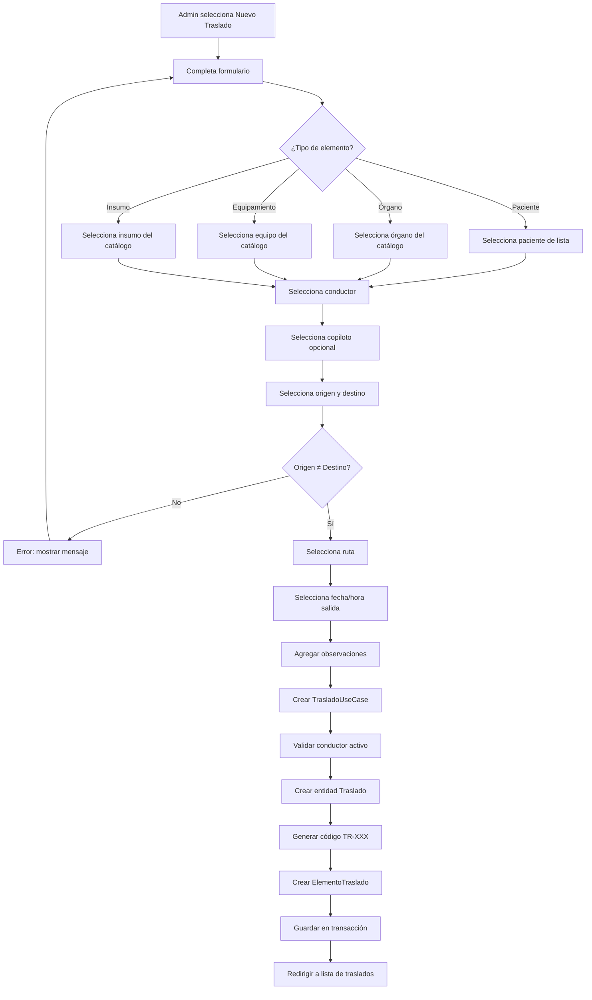

## 3.3 Diagrama de Actividad — Flujo de Tracking GPS

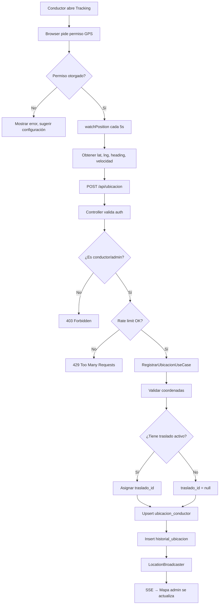

## 3.4 Diagrama de Actividad — Flujo de Login

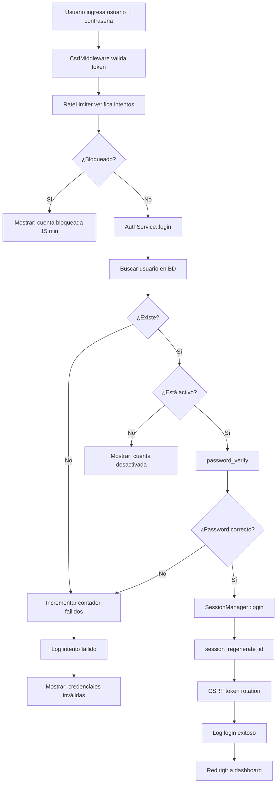

---

# 4. Listas de Acontecimientos

> *Todos los eventos que ocurren en el sistema, clasificados por tipo.*

## 4.1 Eventos Externos (iniciados por actores)

| # | Evento | Actor | Trigger | Respuesta del Sistema |
|---|--------|-------|---------|----------------------|
| E01 | Iniciar sesión | Cualquier usuario | Formulario POST /login | Validar credenciales, crear sesión, CSRF rotation |
| E02 | Cerrar sesión | Usuario autenticado | POST /logout | Destruir sesión, limpiar cookies |
| E03 | Registrarse | Paciente | Formulario POST /registro | Validar datos, crear usuario+paciente, login automático |
| E04 | Solicitar reset password | Cualquier usuario | POST /recuperar-contrasena | Generar token SHA-256, enviar email, rate limit |
| E05 | Ejecutar reset password | Cualquier usuario | POST /restablecer-contrasena | Validar token, actualizar password, invalidar sesiones |
| E06 | Crear funcionario | Admin | POST /funcionarios/crear | Validar datos, bcrypt, crear usuario+funcionario, audit log |
| E07 | Editar funcionario | Admin | POST /funcionarios/editar | Actualizar campos, audit log |
| E08 | Desactivar funcionario | Admin | POST /funcionarios/desactivar | activo=false, audit log |
| E09 | Reactivar funcionario | Admin | POST /funcionarios/reactivar | activo=true, audit log |
| E10 | Crear conductor | Admin | POST /conductores/crear | Validar licencia, bcrypt, crear usuario+funcionario, audit log |
| E11 | Editar conductor | Admin | POST /conductores/editar | Actualizar campos, audit log |
| E12 | Subir documento | Admin | POST /documentos/subir | Validar PDF, MIME, tamaño, generar QR, guardar archivo, audit log |
| E13 | Editar documento | Admin | POST /documentos/editar | Actualizar metadata, audit log |
| E14 | Eliminar documento | Admin | POST /documentos/eliminar | Eliminar archivo, desactivar QR, audit log |
| E15 | Crear encuesta | Admin | POST /encuestas/crear | Crear encuesta + preguntas en transacción, audit log |
| E16 | Responder encuesta | Paciente/Visitante | POST /publico/encuesta | Validar required, guardar respuestas, rate limit |
| E17 | Crear traslado | Admin | POST /traslados/nuevo | Validar conductor, vehiculo, ruta, crear en transacción, audit log |
| E18 | Actualizar estado traslado | Admin/Conductor | POST /traslados/actualizar-estado | Validar FSM, actualizar timestamp, historial, audit log |
| E19 | Registrar GPS | Conductor | POST /api/ubicacion | Validar auth, rate limit, upsert ubicación, broadcast SSE |
| E20 | Crear ruta | Admin | POST /rutas/crear | Validar datos, audit log |
| E21 | Crear noticia | Admin | POST /noticias/crear | Validar título/contenido, subir imagen, audit log |
| E22 | Editar noticia | Admin | POST /noticias/editar | Actualizar campos, reemplazar imagen si existe, audit log |
| E23 | Eliminar noticia | Admin | POST /noticias/eliminar | Eliminar imagen, borrar registro, audit log |
| E24 | Toggle noticia | Admin | POST /noticias/toggle | Cambiar activo, audit log |
| E25 | Ver documento por QR | Visitante | GET /publico/doc?id=X | Buscar documento, verificar activo, mostrar PDF |
| E26 | Ver mis documentos por token | Paciente | GET /publico/mis-documentos?token=X | Validar token, listar documentos del paciente |
| E27 | Ver QR de documento | Admin | GET /documentos/ver?id=X | Mostrar código QR con enlace público |

## 4.2 Eventos Temporales

| # | Evento | Frecuencia | Acción del Sistema |
|---|--------|-----------|-------------------|
| T01 | Expiración de sesión | Cada 30 min de inactividad | `SessionManager::checkTimeout()` destruye sesión |
| T02 | Expiración de token reset | 1 hora después de generación | Token inválido, usuario debe solicitar nuevo |
| T03 | Auto-refresh del mapa | Cada 5 segundos | JavaScript polls `/api/ubicaciones/activas` |
| T04 | Envío GPS del conductor | Cada 5 segundos | `watchPosition()` → POST a `/api/ubicacion` |
| T05 | Limpieza de sesiones stale | Al inicio de cada request | `SessionManager` limpia archivos >30min en `storage/sessions/` |
| T06 | Limpieza de SSE listeners | Cada 30 segundos | `LocationBroadcaster` elimina listeners stale |
| T07 | Expiración de caché de rutas | 30 días | `RouteCacheService` reutiliza rutas cacheadas |
| T08 | Rate limit window reset | 15 min (login), 60s (GPS), 1hr (uploads) | Contadores se resetean automáticamente |

## 4.3 Eventos de Estado (cambios internos)

| # | Evento | Entidad | Transición |
|---|--------|---------|-----------|
| S01 | Traslado creado | Traslado | → pendiente |
| S02 | Traslado iniciado | Traslado | pendiente → en_curso |
| S03 | Traslado en destino | Traslado | en_curso → en_destino |
| S04 | Traslado en retorno | Traslado | en_destino → en_retorno |
| S05 | Traslado completado | Traslado | en_retorno → completado |
| S06 | Traslado cancelado | Traslado | cualquier → cancelado |
| S07 | Funcionario desactivado | Funcionario | activo=true → activo=false |
| S08 | Funcionario reactivado | Funcionario | activo=false → activo=true |
| S09 | Noticia activada | Noticia | activo=false → activo=true |
| S10 | Noticia desactivada | Noticia | activo=true → activo=false |
| S11 | Documento eliminado | Documento | activo=true → DELETE |
| S12 | GPS posición actualizada | UbicacionConductor | upsert (misma fila) |
| S13 | Auditoría registrada | AuditLog | INSERT (nunca UPDATE/DELETE) |

## 4.4 Eventos de Señal (notificaciones)

| # | Evento | Origen | Destino | Mecanismo |
|---|--------|--------|---------|-----------|
| N01 | Nueva posición GPS | Conductor | Mapa admin | SSE (Server-Sent Events) |
| N02 | Estado de traslado cambiado | Conductor/Admin | Dashboard admin | Polling cada 5s |
| N03 | Email de reset password | Sistema | Usuario | PHPMailer + Gmail SMTP |
| N04 | Toast de éxito/error | Sistema | Usuario | JavaScript toast notification |
| N05 | Modal de confirmación | Sistema | Usuario | JavaScript modal (acciones destructivas) |

---

# 5. Diagramas UML

## 5.1 Diagrama de Clases

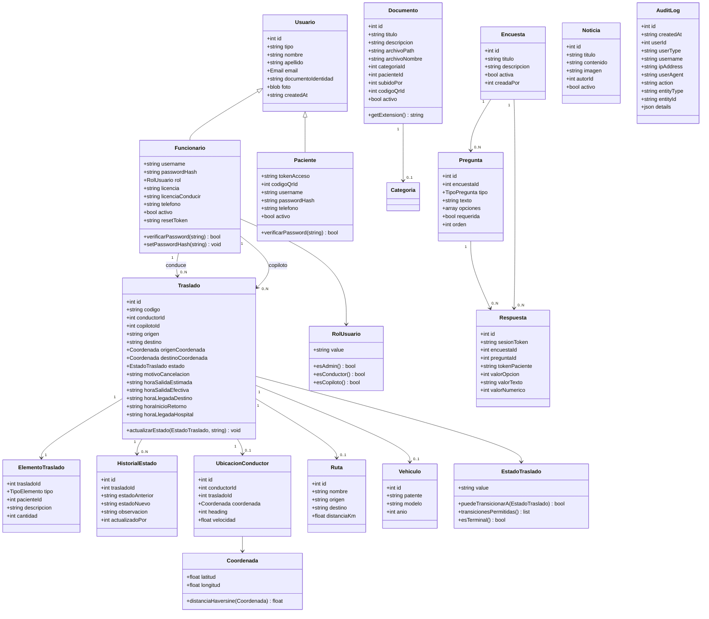

## 5.2 Diagrama de Estados — Traslado

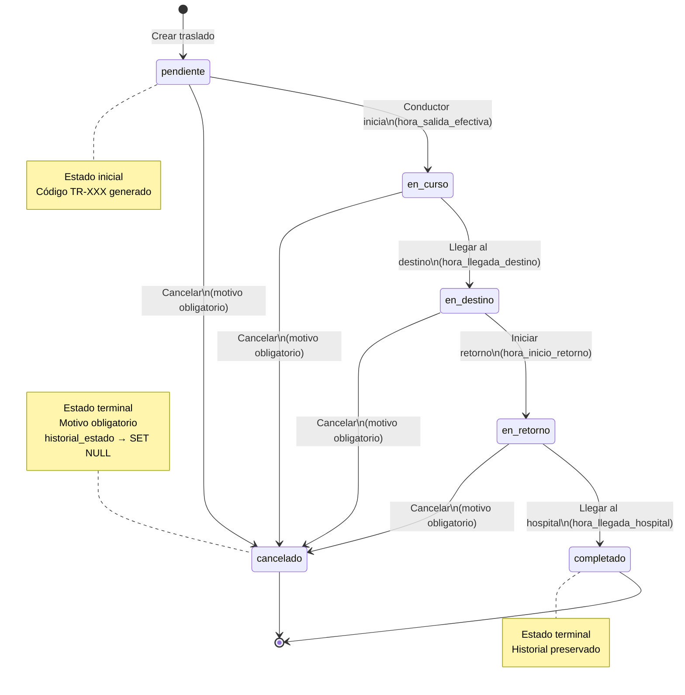

## 5.3 Diagrama de Secuencia — Login

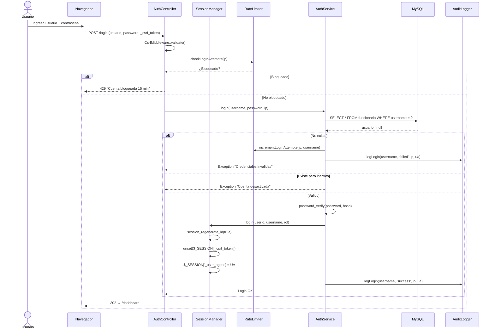

## 5.4 Diagrama de Secuencia — Crear Traslado

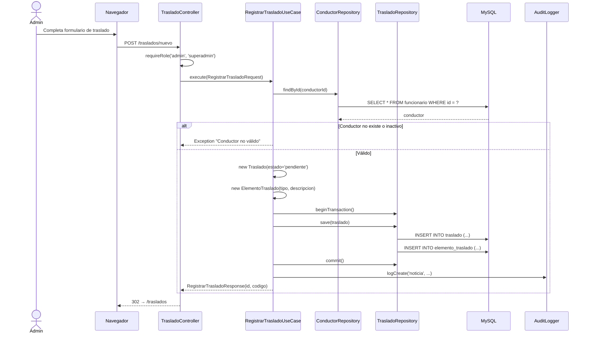

## 5.5 Diagrama de Secuencia — Tracking GPS

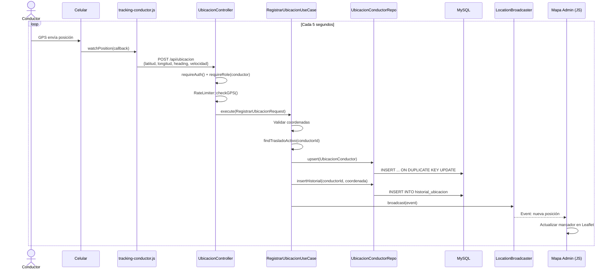

## 5.6 Diagrama de Componentes

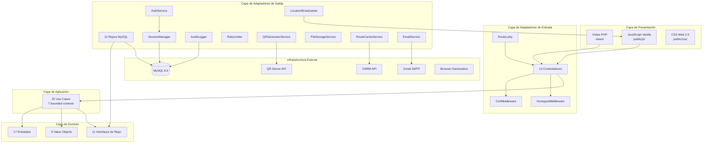

## 5.7 Diagrama de Despliegue

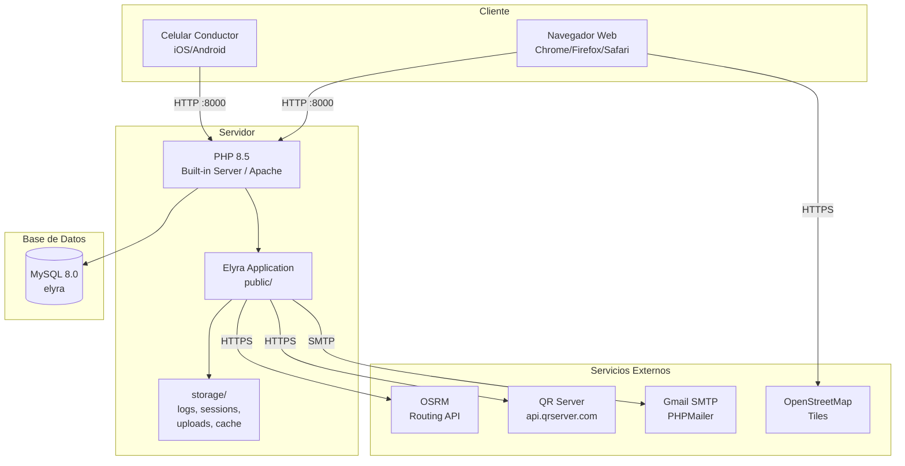

## 5.8 Diagrama de Paquetes

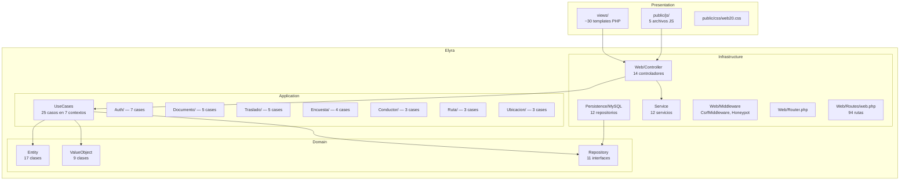

---

# Anexo: Resumen de Métricas del Modelo

| Categoría | Cantidad |
|-----------|----------|
| Entidades de dominio | 17 |
| Value Objects | 9 |
| Interfaces de repositorio | 11 |
| Casos de uso | 25 |
| Controladores | 14 |
| Repositorios MySQL | 12 |
| Servicios de infraestructura | 12 |
| Rutas HTTP | 94 |
| Tablas en BD | 16 |
| Eventos externos | 27 |
| Eventos temporales | 8 |
| Eventos de estado | 13 |
| Eventos de señal | 5 |
| Invariants de negocio | 15 |
| Roles de actor | 11 |
| Servicios externos | 6 |

---

*Documento generado en Julio 2026.*
*Elyra — Sistema de Gestión Hospitalaria — Hospital de Clínicas, Montevideo, Uruguay.*
